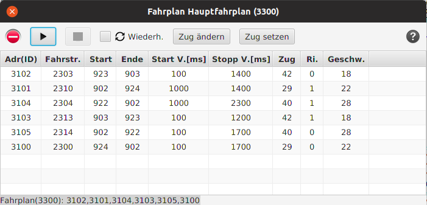

# Fahrplan-Fenster

## Fahrpläne anzeigen

Wenn die Optionen "-r" und "-g" aktiviert sind, so öffnet sich nach dem Start des Programms ein
kleines Fenster, mit dem man Fahrpläne starten kann, die im Panel.XML File gespeichert
sind

Wählen Sie einen Fahrplan aus 

und betätigen "anzeigen", so öffnet sich ein Fahrplan Fenster:

Von diesem Fenster aus kann der Fahrplan gestartet werden und auch gestoppt werden.

### =>> weiter zu [Fahrplan Start](04-Fahrplan_Start.md)

___

