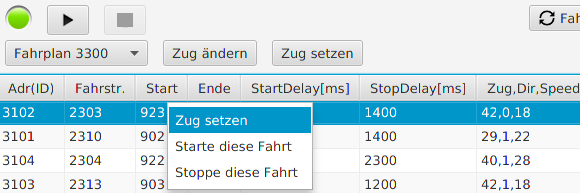

# Fahrplan Stop

Die Taste "Stop" (rechts neben Start)

ist *mit Vorsicht* zu bedienen! Sie führt zum sofortigen Stop aller Züge und Auflösen aller
Fahrstraßen. In der Regel führt dies nämlich zu einem Zustand, der mit dem Neustart des Fahrplans
inkonsistent ist.

In diesem Fall müssen alle Züge wieder manuell zum Startpunkt gefahren werden - die dazu notwendigen
Fahrten können auch individuell aus dem Fahrplan heraus (rechter Mausclick auf eine Zeile des Fahrplans 
"starte diese Fahrt") gestart werden.

Damit ist das Ende des Handbuchs erreicht - bitte schicken Sie mir bei Fragen
eine email - Kontakt siehe SX4-Webseite.

DANKE.

### =>>  zurück zum [Index](index.md)

___

